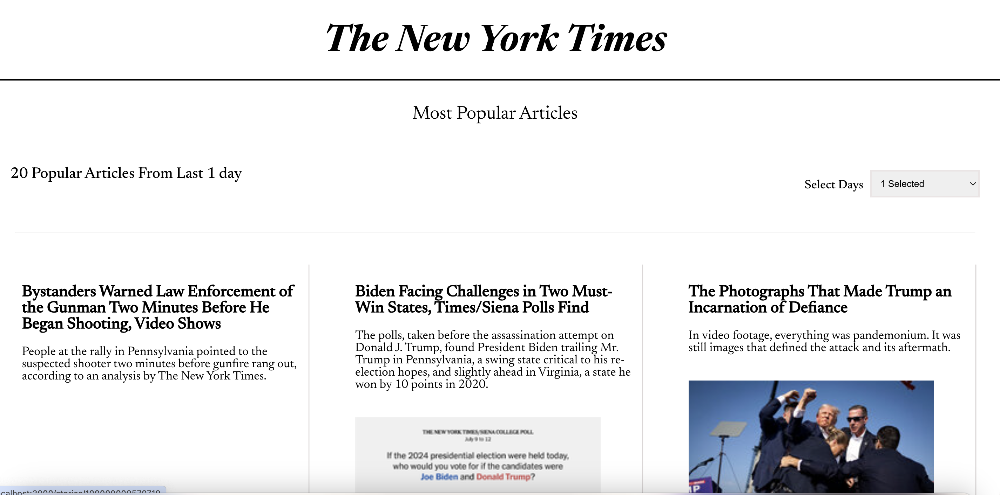
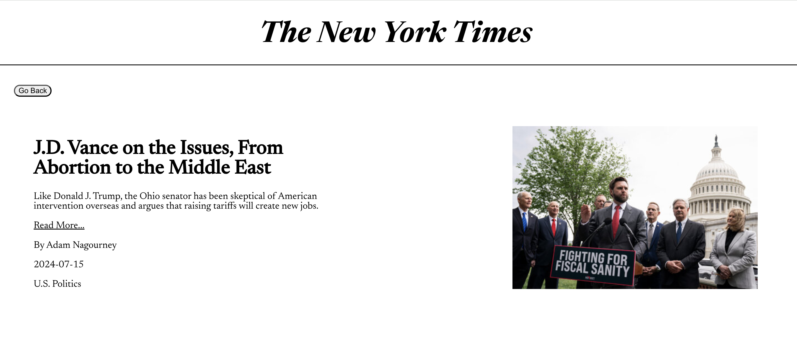
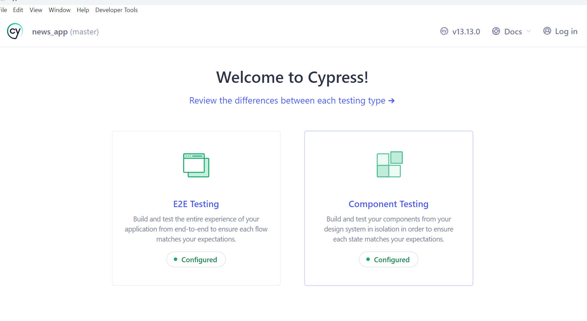
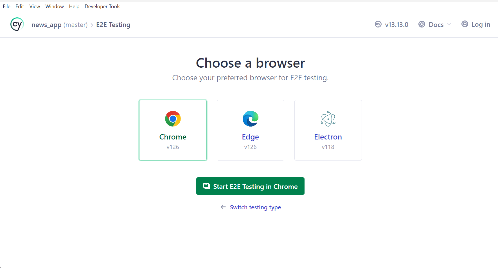

# Article-App-Assignement

React app to hit the NY Times Most Popular Articles API and show a list of articles that shows details when items on the list are tapped (a typical master/detail web app).

## Technical Stack

Web technology - React.JS  
Building Blocks - Java Script  
Styling - CSS  
Managing State - Redux toolkit  
Routing - react router  
API Requests - Axios or Fetch  
Testing - Jest, Cypress  

## Available Scripts

In the project directory, you can run:

### `npm install`

To install all the project related packages from package.json. It will create a yarn.lock
file in you project

### `npm run start`

Runs the app in the development mode.\
Open [http://localhost:3000](http://localhost:3000) to view it in your browser.

The page will reload when you make changes.
You may also see any lint errors in the console.

### `npm run test`

Launches the test runner in the interactive watch mode.
You can find the coverage report in coverage package coverage/icov-report/index.html

### `npm run lint`

Publish the lint report. If any lint issue then shows list of the issues else succeed.

### `npm build`

Builds the app for production to the `build` folder.\
It correctly bundles React in production mode and optimizes the build for the best performance.

The build is minified and the filenames include the hashes.\
Your app is ready to be deployed!

## Version Used

### yarn - 1.22.19

### node - 21.0.0

### npm - 10.2.0

## Cypress E2E testing

### npm install cypress

Above command will add cypress into your code

### npm run cypress open

It will open cypress window and cofigure some steps to add it into you code
After writing cypress test cases. In that window it will execute the test cases.

